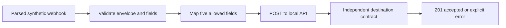

# Webhook Contract Repair

[](https://github.com/JhinxDev/webhook-contract-repair/actions/workflows/ci.yml)

**Repair a webhook payload, then test duplicate delivery and restart recovery.**

A small JavaScript case study for integration repair work. A nested webhook is mapped incorrectly and rejected by its destination. The repaired version validates the input, converts types and sends only the permitted fields.

| Before | After |
| --- | --- |
| Wrong JSON level produces an empty payload | Five validated fields match the receiving contract |
| Destination returns HTTP 422 | Destination returns HTTP 201 |
| Type conversion and validation are absent | Quantity becomes an integer; price becomes exact integer cents |

Personal synthetic project, built with AI assistance. The bug and API are constructed for this demonstration; this is not a client repair or an n8n integration.

## Run it

Requires Node.js 24.15.0 or newer and permission to use loopback HTTP. There are no third-party dependencies, accounts or API keys.

```sh
git clone https://github.com/JhinxDev/webhook-contract-repair.git
cd webhook-contract-repair
npm ci --ignore-scripts
npm test
npm run demo
npm run lab
```

The demo starts a temporary API on `127.0.0.1`, sends both versions and shuts it down. It does not contact an external service. The important output is:

```text
BEFORE: mapper reads the wrong JSON level.
Payload sent: {}
Observed result: HTTP 422, contract mismatch.

AFTER: mapper validates and converts the five allowed fields.
Observed result: HTTP 201, one record accepted in this run.
```

## How it works



The [case study](docs/case-study.md) explains the diagnosis and design choices. The [data contract](docs/contract.md) specifies exactly what is accepted.

## What a reviewer can inspect

| File | Purpose |
| --- | --- |
| [src/map-order.mjs](src/map-order.mjs) | Pure mapping function with explicit validation and an allowlisted output |
| [src/deliver.mjs](src/deliver.mjs) | Bounded local POST; visible errors; no blind retry |
| [fixtures/payload.mjs](fixtures/payload.mjs) | Synthetic input and clearly isolated broken implementation |
| [fixtures/destination.mjs](fixtures/destination.mjs) | Independent API contract and fault simulation |
| [test/](test/) | Regression, boundary and real HTTP tests |

**29 tests pass locally on Windows with Node 24.15.0.** The original 17 cases cover mapping and HTTP boundaries. The 12 new cases exercise durable receipts, duplicates, concurrent processes, restart recovery, conflicts and bounded replay. [Verification details](docs/verification.md).

The new [failure/replay lab](docs/replay-lab.md) prints expected and actual recovery state. It uses built-in SQLite and a synthetic local fulfillment row. Version 0.2.0 adds this lab while preserving the original mapping example. Read the [reliability case study](docs/replay-case-study.md).

GitHub Actions runs the same checks on Windows and Ubuntu. The badge above links to the current run results.

## Boundaries

This exercise begins with a parsed payload, not a public webhook receiver. The replay lab adds persistence and duplicate suppression only for a synthetic local database effect. It has no authentication, signature verification or automatic network retry. Its fixture is not production infrastructure and does not guarantee exactly-once external effects. Read the [security boundaries](SECURITY.md) and [remaining failure windows](docs/replay-lab.md) before adapting it.

The code demonstrates a repair method for this scenario, not a guarantee that an unfamiliar vendor system can be fixed. A client job still requires the actual error, API contract, authorized access and agreed acceptance tests.

## Development and provenance

Run `npm run check` for syntax checks and `npm test` before changes. See [CONTRIBUTING.md](CONTRIBUTING.md) for the small maintenance workflow and [PROVENANCE.md](PROVENANCE.md) for authorship/data transparency.

This public portfolio example is not open-source licensed. See [LICENSE](LICENSE) for the explicit licence status. The npm private flag prevents accidental package publication and does not control GitHub visibility.

Download the versioned source from [Releases](https://github.com/JhinxDev/webhook-contract-repair/releases). For a short presentation outline, see the [walkthrough](docs/walkthrough.md).
